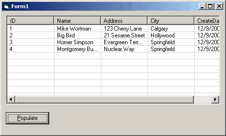



## Easily Bind a Listview Control to a Table or SQL statement\!\!

### Description

Allows you to automatically generate column headers and load all the records from a table or SQL statement into a listview.
 
### More Info
 
takes a listview control and a recordset as parameters

assumes you have ADODB referenced in the project and are using at least VB6. can be tweeked to work with VB5 or less probably though.

none, let me know

             |
---                |---
**Submitted On**   |2001-12-09 12:33:38
**By**             |[Michael Wortman](https://github.com/Planet-Source-Code/PSCIndex/blob/master/ByAuthor/michael-wortman.md)
**Level**          |Intermediate
**User Rating**    |4.5 (36 globes from 8 users)
**Compatibility**  |VB 6\.0
**Category**       |[Databases/ Data Access/ DAO/ ADO](https://github.com/Planet-Source-Code/PSCIndex/blob/master/ByCategory/databases-data-access-dao-ado__1-6.md)
**World**          |[Visual Basic](https://github.com/Planet-Source-Code/PSCIndex/blob/master/ByWorld/visual-basic.md)
**Archive File**   |[Easily\_Bin406231292001\.zip](https://github.com/Planet-Source-Code/michael-wortman-easily-bind-a-listview-control-to-a-table-or-sql-statement__1-29620/archive/master.zip)

### API Declarations

none, all standard calls & controls

